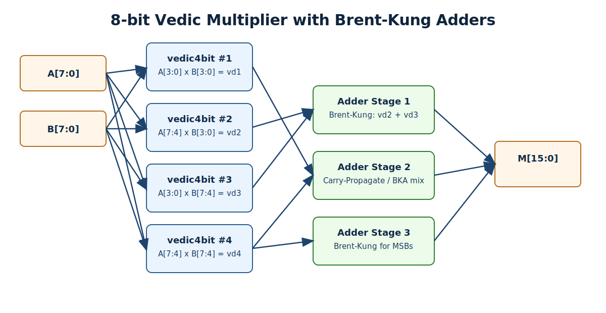
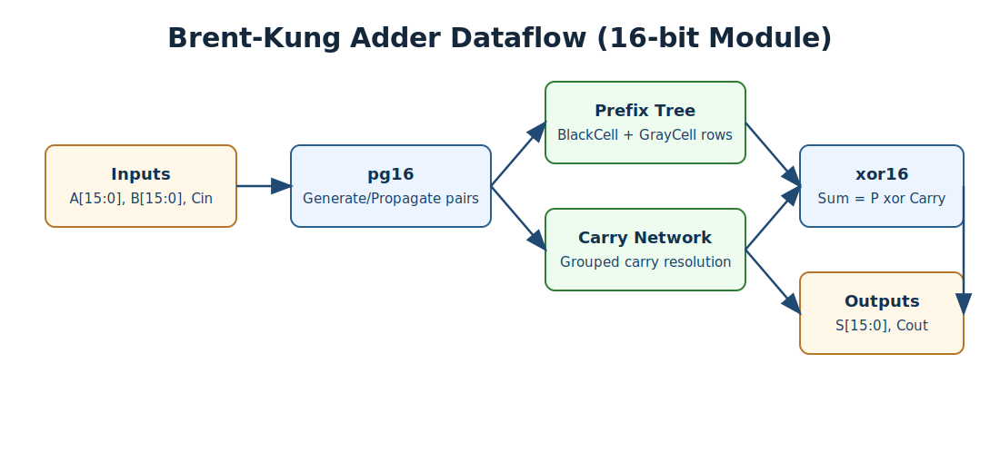

# Design of High-Speed 8-bit Vedic Multiplier using Brent-Kung Adders

[](https://ieeexplore.ieee.org/document/9984591)
[](LICENSE)
[](#)
[](#simulation-with-icarus-verilog)

## Overview

This repository implements an RTL 8x8 unsigned Vedic multiplier using the Urdhva Tiryagbhyam method and Brent-Kung based addition stages for fast carry handling.

The design is based on the published paper:

- `Design of High-Speed 8-bit Vedic Multiplier using Brent Kung Adders`
- 13th ICCCNT 2022, IEEE
- DOI: `10.1109/ICCCNT54827.2022.9984591`

## Architecture

### Top-level composition

- Four `vedic4bit` blocks generate partial products.
- Intermediate sums are merged through adder stages using Brent-Kung and carry-propagate addition.
- Final product output is `M[15:0]`.



### Brent-Kung adder role

- `pg16.v` computes generate/propagate pairs.
- `BlackCell.v` and `GrayCell.v` build the prefix tree.
- `xor16.v` produces final sums from carry and propagate signals.



## Reported Results (from paper)

| Multiplier | Logic Levels | Delay (ns) |
|---|---:|---:|
| Array Multiplier | 19 | 12.934 |
| Dadda Multiplier | 16 | 9.745 |
| Wallace Tree Multiplier | 12 | 7.815 |
| Existing Vedic Multiplier | 15 | 9.130 |
| Proposed Vedic + Brent-Kung | 13 | 7.762 |

## Repository Layout

- `vedic8bit.v`: Top-level 8x8 multiplier.
- `vedic4bit.v`, `vedic2bit.v`: Hierarchical Vedic multiplier blocks.
- `BrentKung.v`, `pg16.v`, `BlackCell.v`, `GrayCell.v`, `xor16.v`: Prefix adder implementation.
- `compat_primitives.v`: Compatibility primitives required by original RTL (`andg`, `org`, `fulladder`, `carryPropAdder`).
- `tb/tb_vedic8bit.v`: Self-checking exhaustive testbench (all 65,536 input vectors).
- `rtl_sources.f`: Icarus file list.
- `run_icarus.ps1`: Windows PowerShell simulation script.
- `run_icarus.bat`: Windows Command Prompt simulation script.
- `docs/images/`: Local architecture diagrams.

## Simulation with Icarus Verilog

### Linux/macOS (Make)

```bash
make run
```

### Windows (Command Prompt)

```bat
run_icarus.bat
```

### Windows (PowerShell)

```powershell
powershell -ExecutionPolicy Bypass -File .\run_icarus.ps1
```

### Expected terminal output

```text
PASS: all 65536 vectors matched.
```

### Waveform

Simulation generates `wave.vcd` for viewing in GTKWave or any VCD viewer.

## Notes

- In this update session, `iverilog` was not installed in the execution environment, so simulation could not be executed here.
- The provided testbench and run scripts are ready to run locally once Icarus Verilog is installed and on `PATH`.

## Citation

```bibtex
@inproceedings{uttarwar2022vedic,
  author    = {Aruru Sai Kumar and U. Siddhesh and N. Sai Kiran and K. Bhavitha},
  title     = {Design of High-Speed 8-bit Vedic Multiplier using Brent Kung Adders},
  booktitle = {13th International Conference on Computing Communication and Networking Technologies (ICCCNT)},
  year      = {2022},
  publisher = {IEEE},
  doi       = {10.1109/ICCCNT54827.2022.9984591}
}
```
