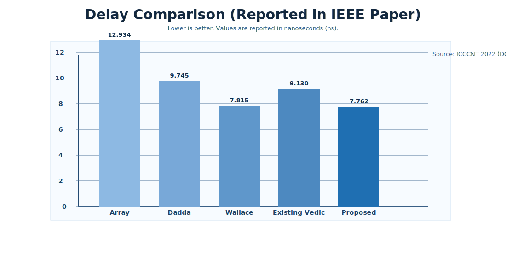
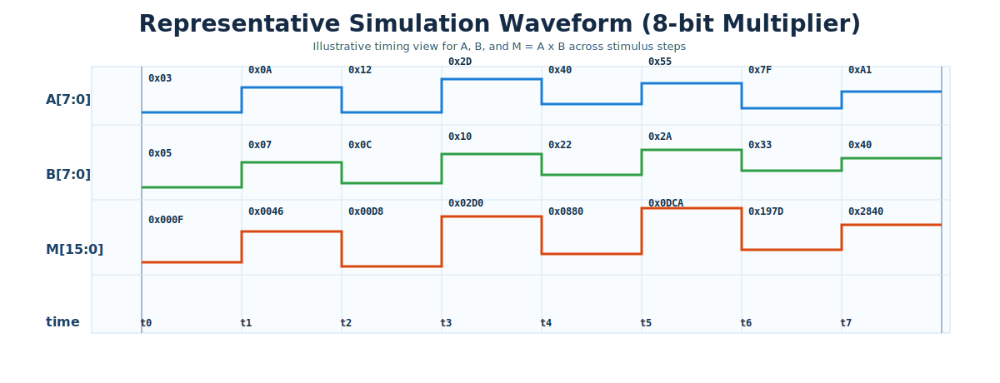

# Vedic Multiplier RTL: 8x8 High-Speed Design with Brent-Kung Adders

[](https://ieeexplore.ieee.org/document/9984591)
[](https://doi.org/10.1109/ICCCNT54827.2022.9984591)
[](LICENSE)
[](#)
[](.github/workflows/iverilog.yml)

A compact, research-backed RTL implementation of an **8x8 unsigned Vedic multiplier** using the **Urdhva Tiryagbhyam** method and **Brent-Kung prefix addition** for improved speed.

## Why This Project Matters

Multiplication dominates arithmetic datapaths in DSP, embedded compute, and accelerators. This design demonstrates how hierarchical Vedic multiplication plus fast prefix carry handling can reduce logic depth versus conventional multiplier structures.

## At a Glance

- Research basis: ICCCNT 2022 IEEE paper.
- Core idea: Vedic partial-product generation + Brent-Kung carry computation.
- RTL style: Fully modular Verilog hierarchy.
- Verification: Exhaustive self-checking testbench over all `256 x 256` input pairs.
- Tool flow: Icarus Verilog scripts for Windows and Make-based flow for Linux/macOS.

## Architecture

### 8-bit top-level composition

- `vedic8bit.v` instantiates four `vedic4bit` blocks.
- Intermediate sums are aligned and merged in staged adders.
- Brent-Kung logic is used in critical addition points.


### Brent-Kung adder dataflow

- `pg16.v`: bitwise generate/propagate extraction.
- `BlackCell.v` and `GrayCell.v`: prefix tree carry network.
- `xor16.v`: final sum generation.


## Reported Paper Results

| Multiplier | Logic Levels | Delay (ns) |
|---|---:|---:|
| Array Multiplier | 19 | 12.934 |
| Dadda Multiplier | 16 | 9.745 |
| Wallace Tree Multiplier | 12 | 7.815 |
| Existing Vedic Multiplier | 15 | 9.130 |
| Proposed Vedic + Brent-Kung | 13 | 7.762 |



## Quick Start

### Linux/macOS

```bash
make run
```

### Windows (CMD)

```bat
run_icarus.bat
```

### Windows (PowerShell)

```powershell
powershell -ExecutionPolicy Bypass -File .\run_icarus.ps1
```

### Expected result

```text
PASS: all 65536 vectors matched.
```

Waveform output is generated as `wave.vcd`.

### Waveform preview



## Verification Strategy

The testbench `tb/tb_vedic8bit.v` is fully self-checking:

- Iterates all possible values of `A` and `B` from `0` to `255`.
- Compares DUT output `M` against reference `A * B`.
- Prints detailed mismatches if any occur.
- Emits pass/fail summary and VCD dump.

## Design Journey

1. Start with Urdhva Tiryagbhyam to generate partial products in parallel through a hierarchy (`2-bit -> 4-bit -> 8-bit`).
2. Replace long ripple-style carry behavior on key merge paths with Brent-Kung prefix logic to reduce effective carry depth.
3. Keep modules composable so the design remains readable, reusable, and easy to verify.
4. Validate correctness exhaustively over the full 8-bit input space before synthesis-oriented optimization.

## Project Structure

- `vedic8bit.v`: top-level DUT.
- `vedic4bit.v`, `vedic2bit.v`: hierarchical Vedic decomposition.
- `BrentKung.v`, `pg16.v`, `BlackCell.v`, `GrayCell.v`, `xor16.v`: prefix adder subsystem.
- `compat_primitives.v`: compatibility wrappers (`andg`, `org`, `fulladder`, `carryPropAdder`).
- `tb/tb_vedic8bit.v`: exhaustive simulation testbench.
- `rtl_sources.f`: ordered source list for Icarus.
- `Makefile`, `run_icarus.bat`, `run_icarus.ps1`: reproducible run entry points.
- `.github/workflows/iverilog.yml`: CI simulation on push/PR.
- `docs/images/`: architecture diagrams.

## Publication

This repository corresponds to the following publication:

- **Design of High-Speed 8-bit Vedic Multiplier using Brent Kung Adders**
- 13th International Conference on Computing Communication and Networking Technologies (ICCCNT), 2022
- IEEE Xplore: <https://ieeexplore.ieee.org/document/9984591>

## Citation

```bibtex
@inproceedings{uttarwar2022vedic,
  author    = {Aruru Sai Kumar and U. Siddhesh and N. Sai Kiran and K. Bhavitha},
  title     = {Design of High-Speed 8-bit Vedic Multiplier using Brent Kung Adders},
  booktitle = {13th International Conference on Computing Communication and Networking Technologies (ICCCNT)},
  year      = {2022},
  publisher = {IEEE},
  doi       = {10.1109/ICCCNT54827.2022.9984591}
}
```

## License

This project is distributed under the [MIT License](LICENSE).
